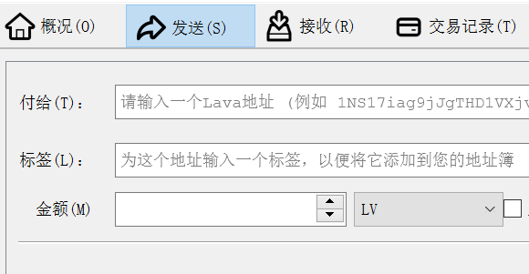
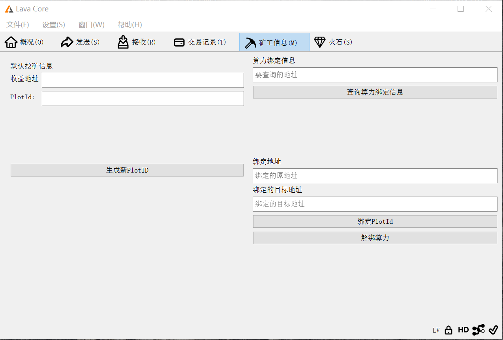
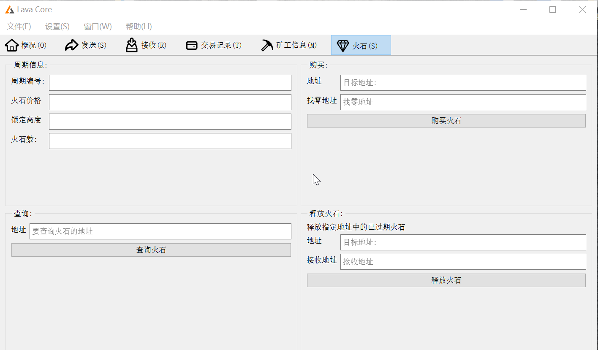

# Windows全节点GUI钱包教程

## 第一次使用钱包以及安全事项

### 1.钱包数据库文件

GUI钱包属于有图形界面的全节点钱包，因此需要维护完整的区块链数据以及钱包文件。

默认的本地数据库文件路径为：

Windows\(C:\)-&gt;User-&gt;\[您的用户名\]-&gt;AppData-&gt;Roaming-&gt;Lava

特别提示：如果您同时运行了非GUI版本的Lava全节点钱包，两者会共享数据库文件。

### 2.备份钱包

  

用户可以随时备份钱包文件，并自定义备份文件的存放位置与文件名称。

只要保存好备份文件，用户就可以恢复钱包以及钱包中的资产。

### 3.设置操作密码（非必须）

用户可以在总菜单“设置”下设置钱包操作密码。

注意，该密码是指对GUI钱包进行操作的解锁密码；设定密码后，用户必须先解锁才能使用钱包进行具体操作，例如收发币、购买火石等等。

解锁时，请进入控制台，并调用`walletpassphrase`命令进行解锁，如下两图所示：

 

 

使用该命令的输入示例：

`walletpassphrase abc123 1000`

示例中输入的`abc123`为设定的密码、`1000`表示在1000秒内保持解锁状态。

### 4.同步区块

 

在初次使用钱包、或者一段时间未使用后再启动钱包的情况下，钱包需要同步到最新区块高度，如上图所示。

当钱包进行同步时，请耐心等待同步完成，未同步完成的钱包是无法使用的。

## 常规操作

### 1.常规功能

 

功能栏提供常用功能的界面：

“概况”可以查看钱包余额。

“发送”可以发起一笔转账交易。

“接收”可用于生成一个付款请求，但由于钱包不支持生成二维码，因此一般无需动用该功能界面。

“交易记录”可查看钱包历史上发生的交易，并针对相关要素进行排序展示。

### 2.控制台

点击菜单的“窗口”-&gt;“控制台”，可以打开控制台界面。

由于本钱包是一个全节点钱包，因此也可支持所有正常全节点钱包所支持的功能。

因此，有技术基础的用户可以直接在控制台中以命令行形式与钱包节点交互。

## 矿工地址与算力绑定操作

 

### 1.生产矿工地址与Plot ID

点击“生成新Plot ID”按钮，即可获得全新的矿工地址以及配套Plot ID。

该矿工地址储存在钱包中，请注意定时备份。

### 2.绑定Plot ID与解绑

在该界面右下角处可进行绑定Plot ID以及绑定后的解绑操作。

### 3.查询绑定信息

在界面右上角处可输入您的挖矿地址，查询该地址当前是否处于绑定状态。

## 火石操作

 

### 1.查询火石周期信息

火石界面左上角可显示当前周期的相关信息。

该信息也可在区块链浏览器的“Firestone Summary”板块中查看。

### 2.购买火石

火石界面右上角提供了购买火石功能。

1）如果您需要给自己的挖矿地址购买火石，在“地址”栏中填入您的挖矿地址、在“找零地址”栏中填入您想要接收找零资金的地址。

2）如果您需要给其他人的地址购买火石，在“地址”栏中填入目标挖矿地址、在“找零地址”栏中填入您想要接收找零资金的地址。

_\*警告：当您给其他人的地址购买火石时，用于购买火石的抵押资金会脱离您的控制，请务必注意目标地址是否为可信者所控制。_

### 3.查询火石

火石界面左下角提供了查询一个地址当前拥有火石的情况。

 

如上图所示，输入您想要查询的地址，钱包会自动弹窗展示该地址下的火石信息。

### 4.释放火石

当您购买的火石过期后，需要手动释放火石抵押的资金（LV）。

在“地址”处填入持有火石的地址、在“接收地址”处填入您想要接收所释放的抵押资金的地址。

_\*注意：您只能释放由您所控制的地址下的火石（也就是您拥有该地址的私钥）。如果您将火石购买到其他人的地址，只能由对方进行释放操作。_

